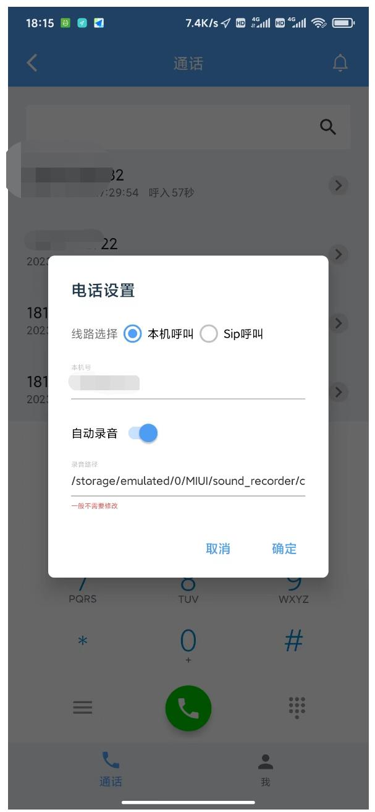

# 更新记录：
- 2023-12-16 ：兼容安卓高版本(12,13)，由于高版本下隐私加强，通话状态监听不好使了，所以本机呼叫模式 从原来的监听通话状态挂断时获取话单，改为呼叫结束后app重新可见时获取话单。
- 2023-12-17 ：由于高版本下(安卓12，13)隐私加强，如果需要获取手机的通话录音文件，需要授权所有文件管理权限，此页面是跳转到手机设置页单独授权的。

# 开发团队

宁卫电话 (nway_phone) 由上海宁卫信息技术有限公司开发并开源，上海宁卫是一家为呼叫中心、指挥调度系统音视频提供技术方案的专业技术公司，拥有14年音视频技术经验，为众多智能客服、视频智能客服、VoLTE等产品提供能力支撑，请您在使用本开源免费产品时，遵守当地法律法规，如有问题请联系 lihao@nway.com.cn。 宁卫信息官网 [http://www.nway.com.cn/](http://www.nway.com.cn/)

#nway_phone介绍

- nway_phone是一款安卓端sip软电话客户端。作为一个android softphone sip client,支持sip账号的注册，解注册，发起呼叫，录音等功能。
- nway_phone同时可以支持本机号码呼叫，封装了大部分主流机型的电话事件监听，以及自动录音的判断和录音文件路径的获取。
- libs下是自编译的linphone 5.2.110版本，支持g729,g722，g711,gsm等语音编码，和h264,VP8,MPEG4等视频编码，支持 gb2818 jt1708 rtmp rtsp。由于项目主要是音频需求，所以没有封装视频相关方法，如果想要做成sip video client，可以参照linphone官网接口来调用。
